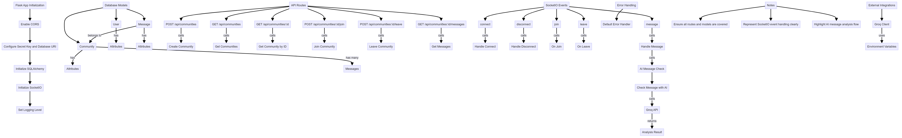

## CapitalCrew Backend

### Tech Stack

- Flask
- SocketIO
- CORS
- SQLAlchemy
- Groq
- Pandas
- Matplotlib

### Installation

- Clone the repo
- Create a virtual environment
- Run `pip install -r requirements.txt` to install dependencies

## Analysis API
The analysis API is used to perform the following operations:
### price_api.py
- Get the plot of the provided Stock name (Via Polygon API)
- Get the price of the provided Stock name (Via Polygon API)
### price_api.py
- Uses the recent news, sentiment, and price of the provided Stock name to provide the information about the state of the stock

## Community and Chats
### Summary_response.py
- Provides the summary of the unread text messages in the same language as the text using llama-3.1-70b model
### chat_flask.py
- Web Application Setup: The code sets up a Flask web application with CORS enabled, connects to a SQLite database using SQLAlchemy, and configures Socket.IO for real-time communication.

- Database Models: It defines three SQLAlchemy models—Community, User, and Message—with relationships between them. Community holds information about chat communities, User represents users, and Message stores messages within communities.

- API Endpoints:

- Community Management: Endpoints for creating (POST /api/communities), retrieving (GET /api/communities and GET /api/communities/<id>), joining (POST /api/communities/<id>/join), and leaving (POST /api/communities/<id>/leave) communities.
- Messages: An endpoint to retrieve messages for a community (GET /api/communities/<id>/messages).
Real-time Communication: It uses Socket.IO to handle real-time events:

- Connection and Disconnection: Logs client connections and disconnections and manages active users. 
- Join/Leave: Manages users joining and leaving chat rooms.

- Message Handling: Handles incoming messages, checks them for appropriateness using the Groq AI API, stores them in the database, and broadcasts them to other users.
- AI Moderation: It includes a function to check the appropriateness of messages using the Groq AI API. Messages flagged as inappropriate are broadcasted as flagged messages, including reasons for flagging.

### models.py
- Database Models: Defines Community, User, and Message models for handling chat communities, users, and messages, respectively, with relationships and attributes.

- Serialization: Each model includes a to_dict() method to convert model data into JSON-compatible dictionaries for easy API responses.

### Flow diagram

